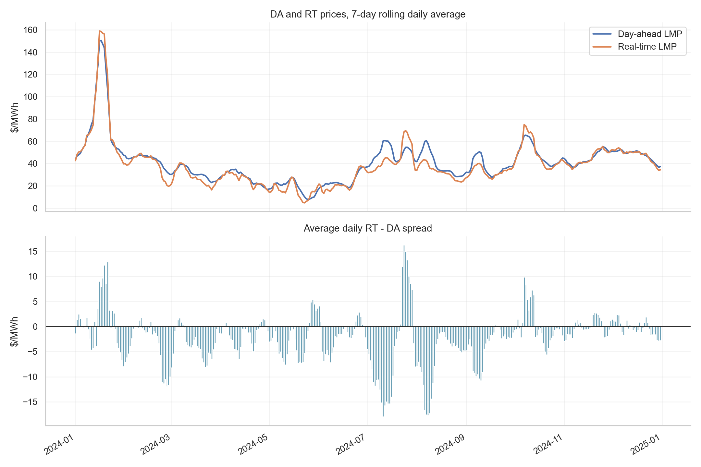
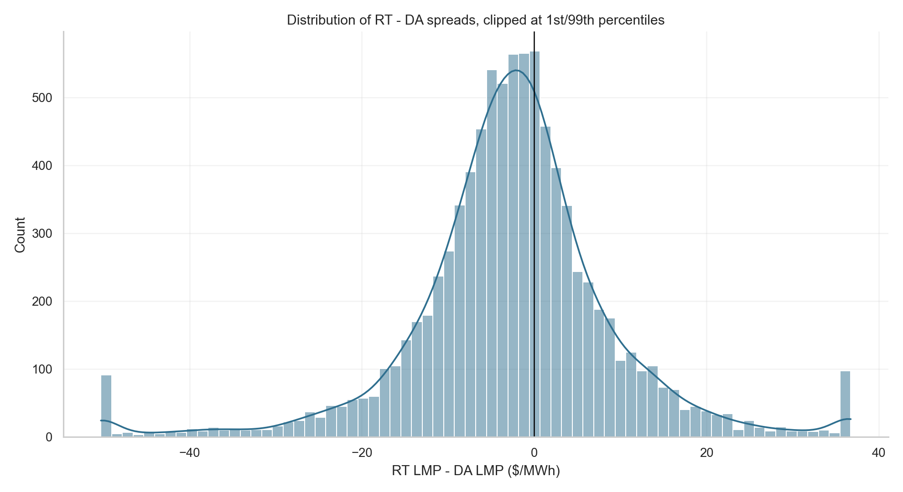
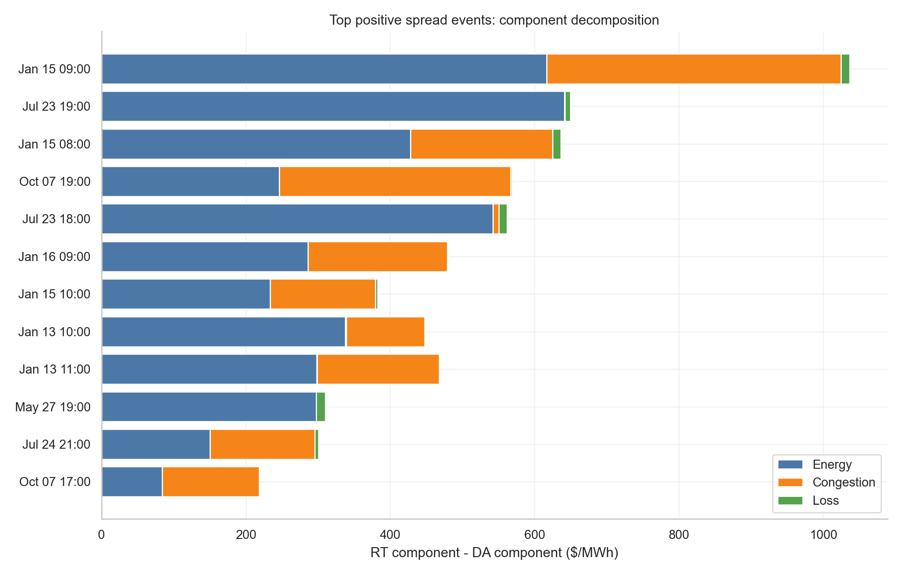
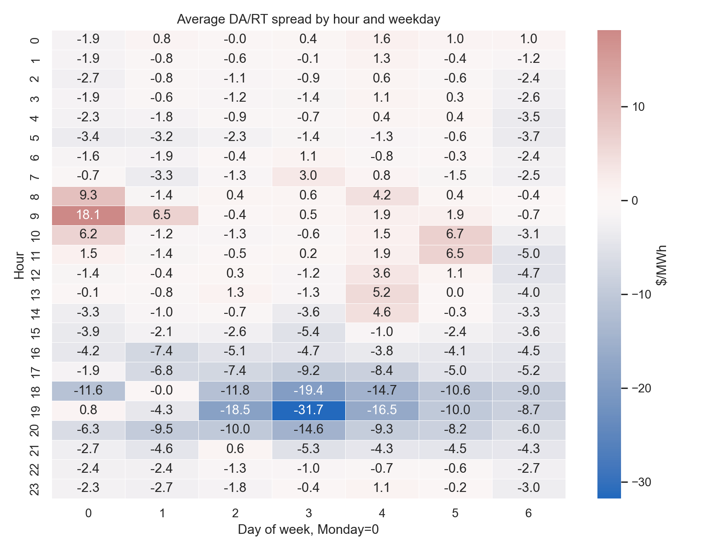
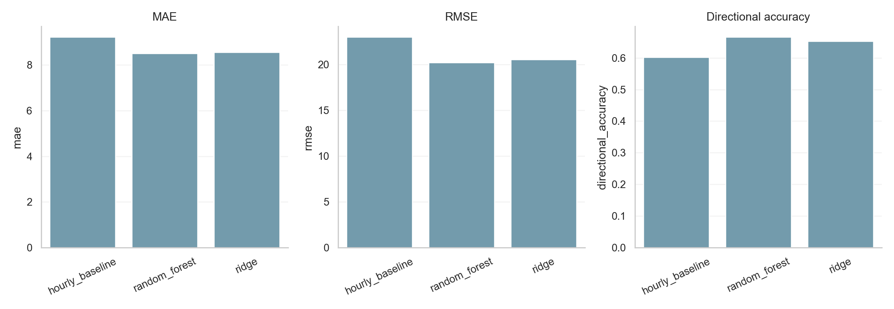
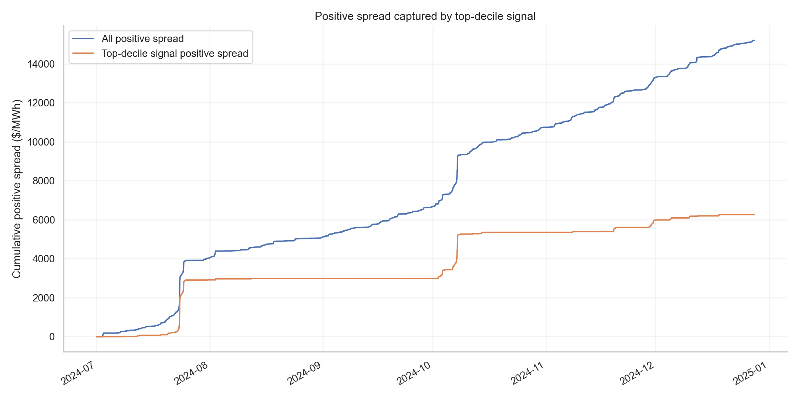

# Research Brief

## Summary

This project studies one year of CAISO day-ahead and real-time LMPs for `TH_NP15_GEN-APND`.

The question is simple:

> When does real-time price correct the day-ahead expectation, and can simple features help identify those hours?

The project treats the DA/RT spread as a market surprise:

```text
Spread = RT LMP - DA LMP
```

## Data Choice

I used CAISO OASIS because it gives the right structure for this question:

- same location in day-ahead and real-time,
- full year of hourly prices,
- public reproducibility,
- LMP components for energy, congestion, and losses.

This matters because large spreads should be explained, not only plotted.

## Market Logic

LMP can be decomposed as:

```text
LMP = Energy + Congestion + Loss
```

So:

```text
RT LMP - DA LMP
= RT energy correction
+ RT congestion correction
+ RT loss correction
```

An energy-led spread points toward broad system stress. A congestion-led spread points toward a local grid constraint moving differently in real time than the day-ahead market expected.

## Visual Story



The rolling DA/RT chart gives the broad regime view without letting one hourly spike dominate the scale.



The spread distribution is fat-tailed. Most hours are ordinary, but a small number of hours matter much more.



The component chart explains the largest positive spread events. This is the main fundamentals check.



The heatmap shows that delivery timing matters, which is why an hourly baseline is a useful benchmark.

## Model Results



| Model | MAE | RMSE | Directional Accuracy |
|---|---:|---:|---:|
| Hourly baseline | 9.23 | 23.01 | 60.14% |
| Ridge | 8.55 | 20.55 | 65.23% |
| Random Forest | 8.52 | 20.21 | 66.62% |

The hourly baseline is strong because power markets have intraday structure. Ridge and Random Forest improve on it, which suggests that lagged spreads, day-ahead price level, and rolling volatility contain useful information.

## Signal Result



The top 10% of Random Forest-ranked hours captured 41.19% of total positive spread in the tested period.

That is the main result. The model is not a perfect price forecaster. It is a screen for hours where positive real-time correction risk is more concentrated.

## How I Read The Output

A useful candidate hour should have:

- high predicted spread,
- abnormal spread versus recent history,
- clear energy or congestion explanation,
- supportive recent regime behavior,
- acceptable downside risk.

The workflow is:

```text
identify spread -> decompose driver -> check regime -> compare model ranking -> decide whether it deserves deeper review
```

## Extensions

The next step would be to add:

- load forecasts,
- weather forecasts,
- renewable output,
- outages,
- gas prices,
- transmission constraints,
- multiple hubs or nodes.

