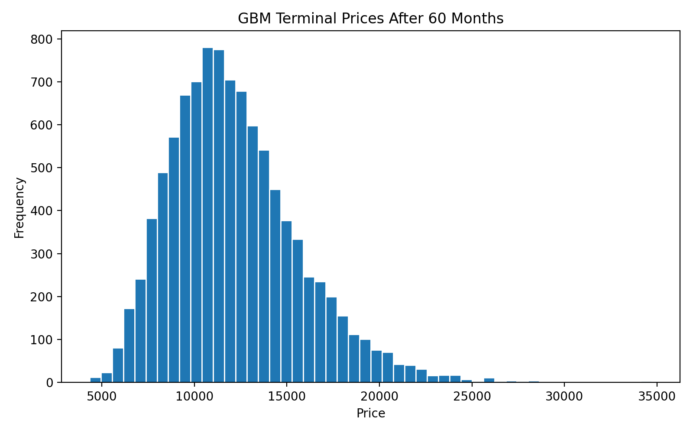
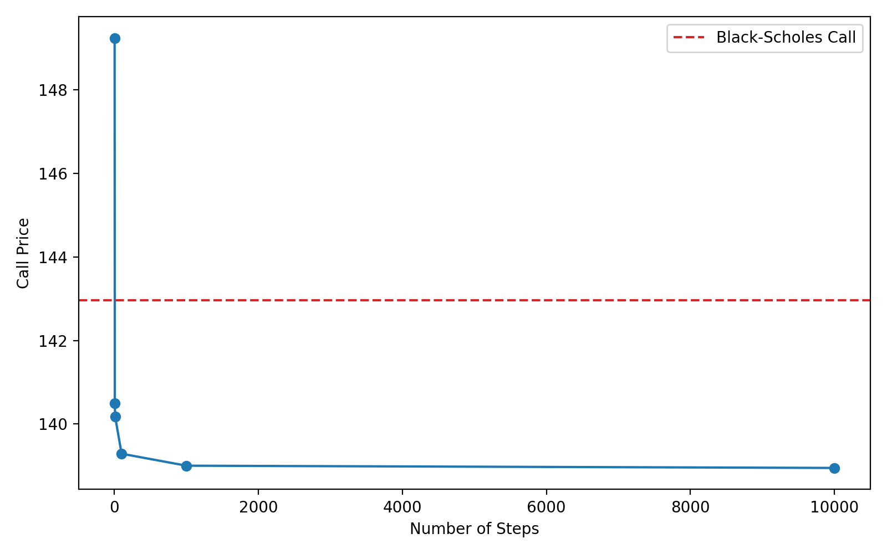
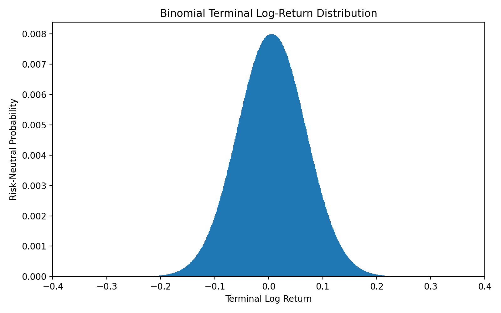

# S&P 500 Return Modeling and Option Pricing

This project packages a stochastic processes assignment into a cleaner, recruiter-facing repository. The analysis starts from monthly S&P 500 index data, estimates return dynamics, simulates future prices with geometric Brownian motion, and prices options with both Black-Scholes and binomial tree methods.

## What This Project Covers

- Estimation of monthly simple and log returns from S&P 500 data.
- Hypothesis testing for the mean return and normality checks.
- Monte Carlo simulation of confidence intervals for the mean return.
- Geometric Brownian motion (GBM) modeling for long-horizon price forecasts.
- Risk-neutral probability estimation by simulation and closed form.
- European and American option pricing with recombining binomial trees.
- Convergence of the binomial model toward Black-Scholes prices.

## Repository Layout

```text
sp500-option-pricing/
├── data/
│   └── SP500.csv
├── figures/
├── requirements.txt
├── src/
│   └── analysis.py
└── README.md
```

## Mathematical Idea

The monthly simple return is computed as

\[
R_t = \frac{S_t}{S_{t-1}} - 1
\]

and the monthly log return is

\[
r_t = \log\left(\frac{S_t}{S_{t-1}}\right).
\]

For geometric Brownian motion, the stock price process is modeled as

\[
S_t = S_0 \exp\left(\left(\tilde{\mu} - \frac{1}{2}\tilde{\sigma}^2\right)t + \tilde{\sigma} W_t\right),
\]

where \(\tilde{\mu}\) and \(\tilde{\sigma}\) are estimated from the observed log returns. This makes the terminal stock price lognormal, which is why both simulation and Black-Scholes style calculations become natural tools here.

For option pricing, the project also uses a recombining binomial tree. At each step, the stock either moves up by a factor \(u\) or down by a factor \(d\). Under the risk-neutral measure, the up probability is

\[
q = \frac{1 + r - d}{u - d}.
\]

Backward induction then gives the no-arbitrage option price. As the number of steps increases, the binomial prices approach the Black-Scholes benchmark.

## Main Workflow

### 1. Return Estimation

The script loads the monthly S&P 500 series and computes:

- sample mean and sample volatility of simple returns,
- a z-test for whether the mean return differs from zero,
- a Shapiro-Wilk test for normality.

This section answers whether the data supports a positive drift and whether a normal approximation for returns looks reasonable.

### 2. Monte Carlo Confidence Intervals

Using the estimated mean and volatility, the script simulates many samples of returns and builds 95% confidence intervals for the mean. This gives a sense of how stable the estimated drift is across repeated samples.

### 3. GBM Forecasting

The project estimates the GBM parameters from log returns and simulates terminal prices over a 60-month horizon. It also reports:

- the analytical expected price under the fitted model,
- the simulated mean terminal price,
- a Jarque-Bera test on simulated log terminal prices.

The point here is to connect empirical estimation with a standard continuous-time asset model.

### 4. Risk-Neutral Probability Check

Under a risk-neutral version of the GBM model, the script estimates the probability that the index ends below a fixed level. It computes this probability in two ways:

- by Monte Carlo simulation,
- by the corresponding closed-form normal calculation.

The agreement between the two is a useful validation check.

### 5. Binomial Option Pricing

The second half of the project prices call and put options using recombining trees. It includes:

- a baseline three-step tree,
- scaled trees with larger numbers of steps,
- convergence plots for call and put values,
- a comparison against Black-Scholes,
- American option prices,
- a put-call parity check.

This part shows both numerical implementation skill and understanding of no-arbitrage pricing.

## Running The Analysis

From the project root:

```bash
pip install -r requirements.txt
python3 src/analysis.py
```

The script prints the main numerical results and saves figures to `figures/`.

## Notes On Presentation

This repository is intentionally kept small. The code is organized as a single readable script, with the mathematics explained here instead of being hidden inside a long notebook. That makes it easier for someone reviewing the repository to understand both the implementation and the financial reasoning without reading coursework-style cells in sequence.

## Selected Results

- The sample mean monthly return is about `1.07%`, with a z-test p-value near `0.0017`.
- The Shapiro-Wilk test rejects normality for monthly simple returns, which is a useful reminder that the normal model is an approximation rather than a literal description of data.
- The fitted 60-month GBM forecast gives an expected terminal index level of roughly `12,180`.
- The risk-neutral probability of ending below `6300` after 60 months is about `53%`, and the Monte Carlo estimate is very close to the closed-form value.
- The binomial call and put prices converge toward the Black-Scholes benchmarks as the number of steps increases.

## Figures

### GBM Terminal Price Distribution



### Call Price Convergence



### Put Price Convergence


### Binomial Terminal Log-Return Distribution


